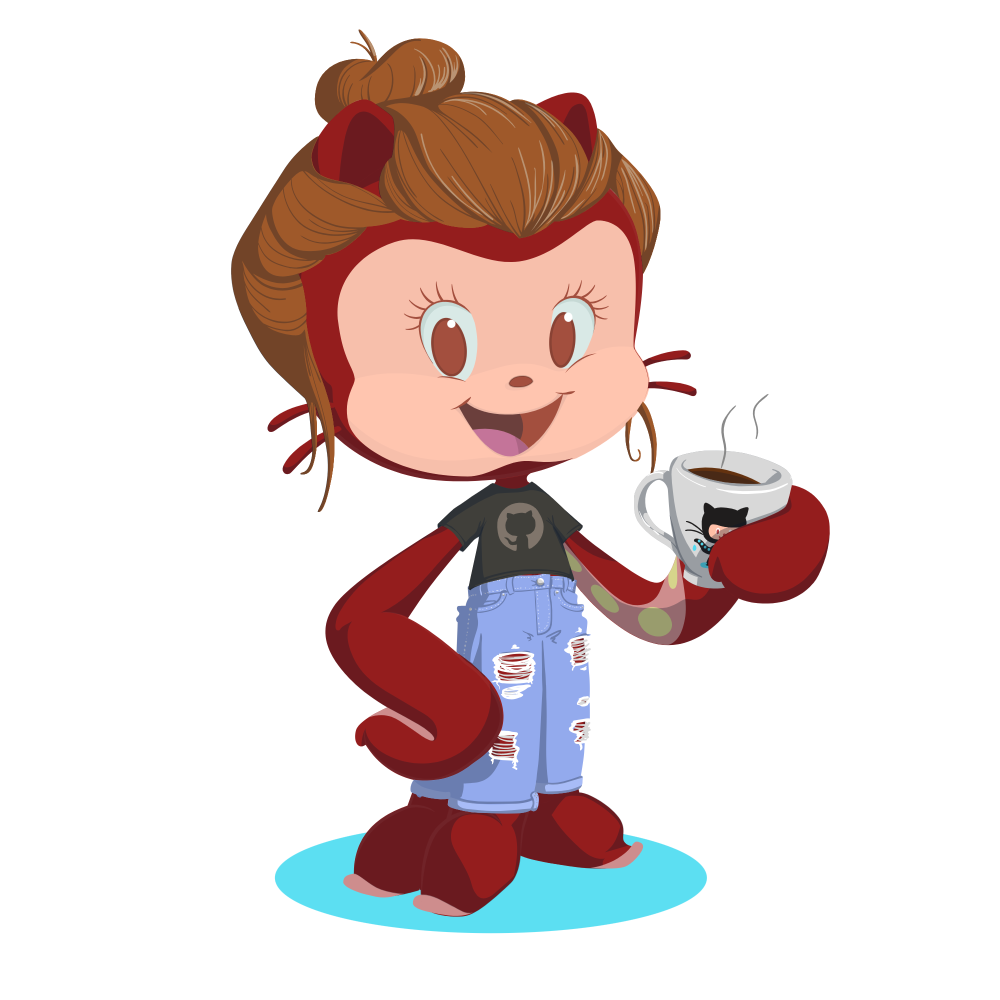

### Hi there, I'm BEA! 👋
- 🚀 Front-end developer with expertise in building modern web applications.
- 💻 Proficient in HTML, CSS, JavaScript, TypeScript, and various front-end frameworks.
- 🌐 Currently working with React, Next.js, and leveraging React Hooks and Redux for state management.
- 🛠️ Experienced in testing with Jest and Cypress.
- ☁️ Familiar with Azure for cloud services and Docker for containerization.

<!--  -->

  

  
  
  
  
  
  
  
  
  
  

